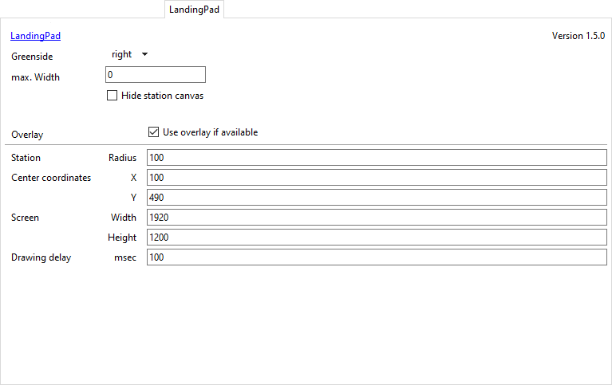

# Landingpad display plugin for [EDMC](https://github.com/Marginal/EDMarketConnector/wiki)

This plugin helps people to find their assigned landingpad position in starports.

## Installation

* On EDMC's Plugins settings tab press the “Open” button. This reveals the `plugins` folder where EDMC looks for plugins.
* Download the [latest release](https://github.com/bgol/LandingPad/releases/latest).
* Open the `.zip` archive that you downloaded and move the `LandingPad` folder contained inside into the `plugins` folder.

You will need to re-start EDMC for it to notice the new plugin.

## Settings

* Greenside: which side are the green navigation lights
  - right (Default)
  - left
* max. Width: maximum width of the station inside the EDMC window
  - 0 (Default, no limitation)
  - -1 (current window width, will be replaced with the actual value after closing the settings)
  - otherwise the minimum value is 150
* Hide station canvas: Don't show the station graphic in the EDMC window.
* Overlay
  - Use overlay if available: if the EDMCOverlay plugin is installed use it (Default: off)
  - Station Radius: the radius of the overlay station (Default: 100)
  - Center coordinates X/Y: the center position of the overlay station (Default: 100/490)
  - Screen Width/Height: the gamescreen resolution to keep the right aspect ratio (Default: screen of EDMC)
  - Drawing delay: delay between each drawing step in milliseconds (allowed range: 0 .. 500, Default: 100)

## Acknowledgements

[Habitable Zone plugin](https://github.com/Marginal/HabZone) from Jonathan Harris used as template.

## License

Copyright © 2018 Bernd Gollesch.

Licensed under the [GNU Public License (GPL)](http://www.gnu.org/licenses/gpl-2.0.html) version 2 or later.
